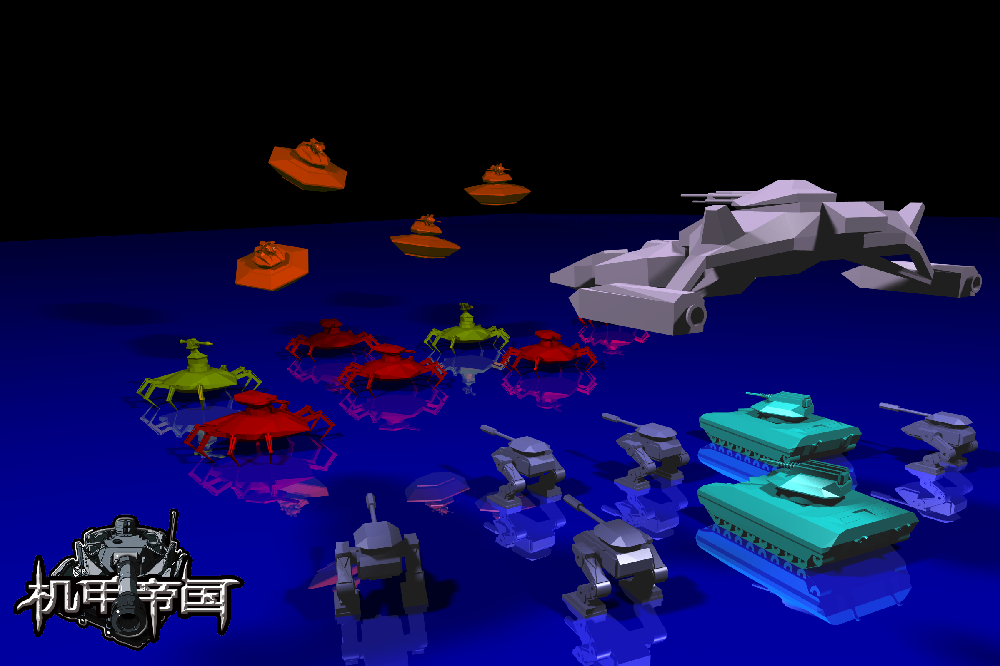
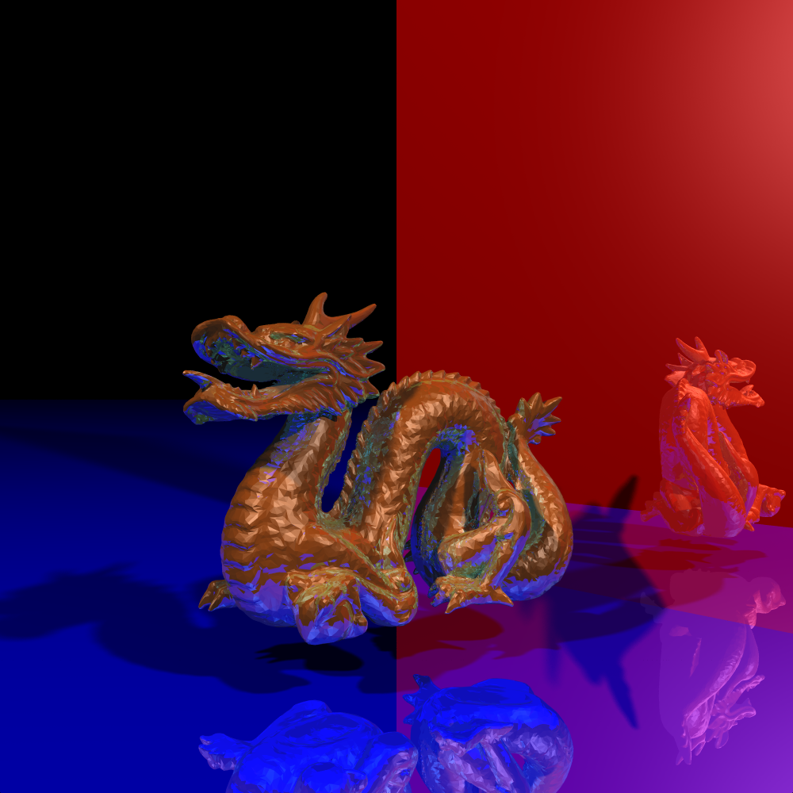
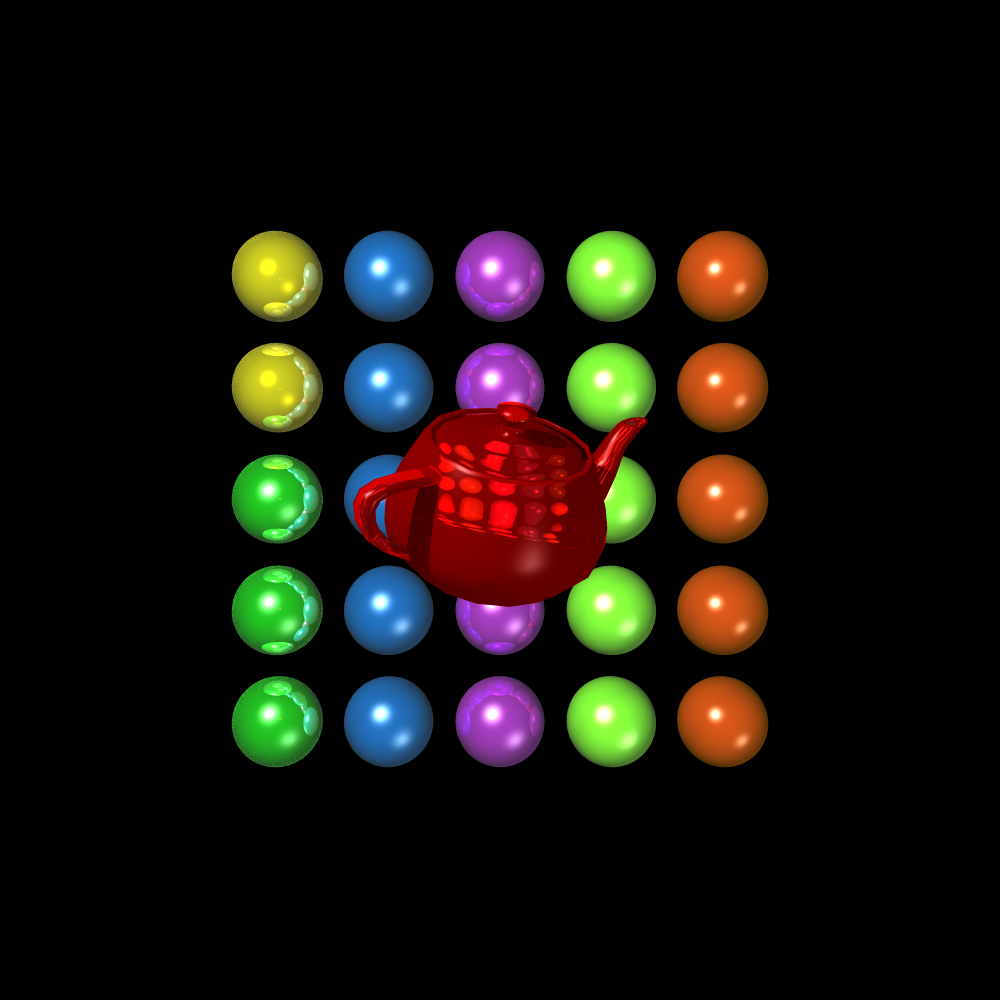
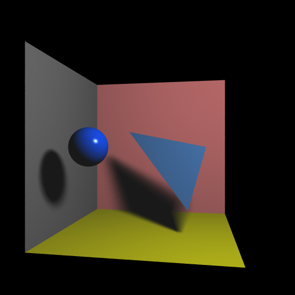
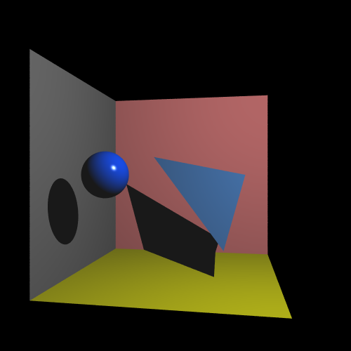

Assignment 2 RayTracer
=================================

By Shuai Shao

-----------------------------------






-------------------------------
* anti-aliasing


* soft shadow





---------------------------------


Platform: Windows

Compiler: MSVS (VS2012)


---------------------------------

Extra features input file format:

* Accleration:
Use a AABB tree to acclerate rendering.
Render a 1000 x 1000 image for an obj file consisting of more than 10000 faces will take no more than 10 seconds.


* Refraction:
Input format:
`mat kar kag kab kdr kdg kdb ksr ksg ksb ksp krr krg krb [ktr ktg ktb ni]`

Where ktr,ktg,ktb are color for refraction, and ni is a float storing material index of refraction.


* Anti-aliasing
Input format:
`antialiasing n`

Where n is an integer. For each pixel, the ray tracer will get n x n samples.


* Area light (generate soft shadow)
	Input format:
	`ltarea cx cy cz hlux hluy hluz hlvx hlvy hlvz r g b n`

Where (cx,cy,cz) is the center of the light, u=(hlux,hluy,hluz) and v=(hlvx,hlvy,hlvz) are two half length vectors that can represent the rectangle of the light(c + a*u + b*v, -1 < a,b < 1); r,g,b is the color, and n is the number of rays generated for each shadow ray.


* resolution
	Input format:
	`cam ex ey ez llx lly llz lrx lry lrz ulx uly ulz urx ury urz [pixel length]`

	Where pixel length is the length of sample on the film (screen), default is set to 0.1

Other input file format are identical to the document for ass2:

* Each line in the file specifies some sort of object, light, material, camera, or transformation.

* The camera object is specified by a line of the following form:
`cam ex ey ez llx lly llz lrx lry lrz ulx uly ulz urx ury urz`

* There will only be only camera line in a file.

* A sphere is specified by:
`sph cx cy cz r`

* A triangle is specified by:
tri ax ay az bx by bz cx cy cz

* A .obj file is specified by:
obj "file name”

* A point light source is specified by:
ltp px py pz r g b [falloff]
Where falloff is 0 for no falloff, 1 for linear, or 2 for quadratic, and the default is 0

* A directional light source is specified by:
ltd dx dy dz r g b

* An ambient light source is specified by:
lta r g b

* A material is specified by:
mat kar kag kab kdr kdg kdb ksr ksg ksb ksp krr krg krb
Where ka, kd, ks, and kr are the coefficients for ambient, diffuse, specular, and reflective.

* A transformation is specified by any of the following:
```
xft tx ty tz
xfr rx ry rz
xfs sx sy sz
```

These refer in order to translation, rotation, and scaling. Rotations are exponential maps in degrees.

• Transformations apply cumulatively in the reverse order they appear in the file.
Thus the following lines:
```
xfr 45 0 0
xfs 1 1 2
xfr -45 0 0
xft 1 2 3
```
Would result in the following transformation matrix:
[r 45 0 0]*[s 1 1 2]*[r -45 0 0]*[t 1 2 3]
• When an object line is read, the current transformation will be applied to that object.
• Transformations also apply to lights or the camera. However, you are not required to implement
this feature. If your input files contain camera and all light lines before the first transformation
then this feature would have no effect.
• The current transformation may be reset to the identity with the following line:
xfz